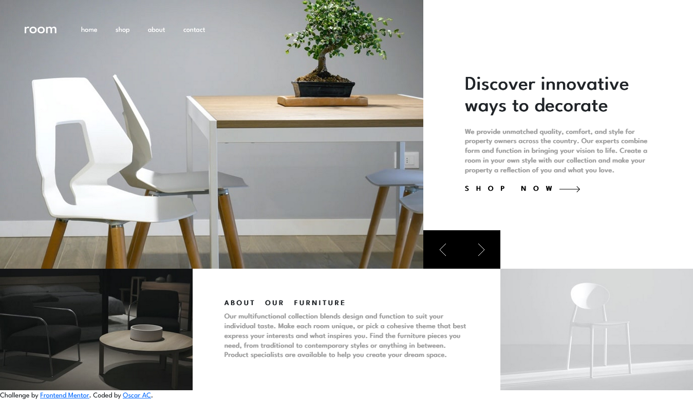

# Frontend Mentor - Room homepage solution

This is a solution to the [Room homepage challenge on Frontend Mentor](https://www.frontendmentor.io/challenges/room-homepage-BtdBY_ENq). Frontend Mentor challenges help you improve your coding skills by building realistic projects. 

## Table of contents

- [Overview](#overview)
  - [The challenge](#the-challenge)
  - [Screenshot](#screenshot)
- [My process](#my-process)
  - [Built with](#built-with)
  - [What I learned](#what-i-learned)
  - [Continued development](#continued-development)
- [Author](#author)

**Note: Delete this note and update the table of contents based on what sections you keep.**

## Overview

### The challenge

Users should be able to:

- View the optimal layout for the site depending on their device's screen size
- See hover states for all interactive elements on the page
- Navigate the slider using either their mouse/trackpad or keyboard

### Screenshot

### Links

- Solution URL: [https://oscar-ac.github.io/room/](https://oscar-ac.github.io/room/)
- Live Site URL: [https://oscar-ac.github.io/room/](https://oscar-ac.github.io/room/)

## My process

### Built with

- CSS custom properties
- Flexbox
- CSS Grid
- Mobile-first workflow
- [Bootstrap](https://reactjs.org/) - JS library

### What I learned

How to make a slider/carousel from scratch. There were several factors to keep in mind, such as: how the data for the slides would be stored, how to update the slides, and how to have control over which actions allow users to change slides.

You can see the approach i had to this challenge here: [carousel.js](https://github.com/Oscar-ac/room/blob/main/js/carousel.js)

it may not be the most scalable method but i think it works quite well for this application. I didn't want to import a library such as slick and be forced to used jquery for such a small project.

Capabilities of grid and being able to nest those elements made aspect of the challenge quite interesting. The buttons are in a nested grid and use flex box and position: absolute to get them positioned correctly. It was a pain for me to be able to get the buttons to fill the space between the images properly. In the end, I got it to fit.

### Continued development

I want to continue focusing on my usage of grid, and how its limitations and abilities fit together with flex to deliver a complete package. I also want to continue my usage of vanilla js and not relying on frameworks like jquery which are on thier way out of the web ecosystem.

## Author

- Website - [Oscar AC](https://www.oscar-dev.online)
- Frontend Mentor - [@Oscar-ac](https://www.frontendmentor.io/profile/Oscar-ac)
